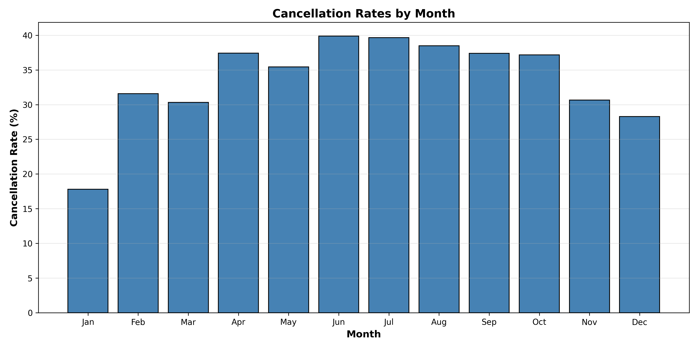
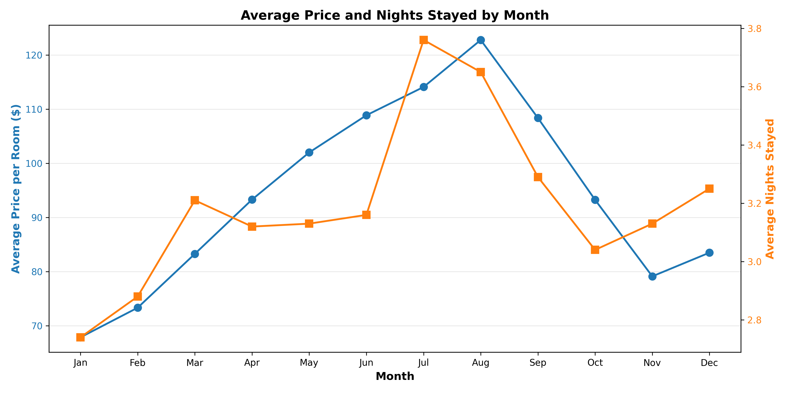
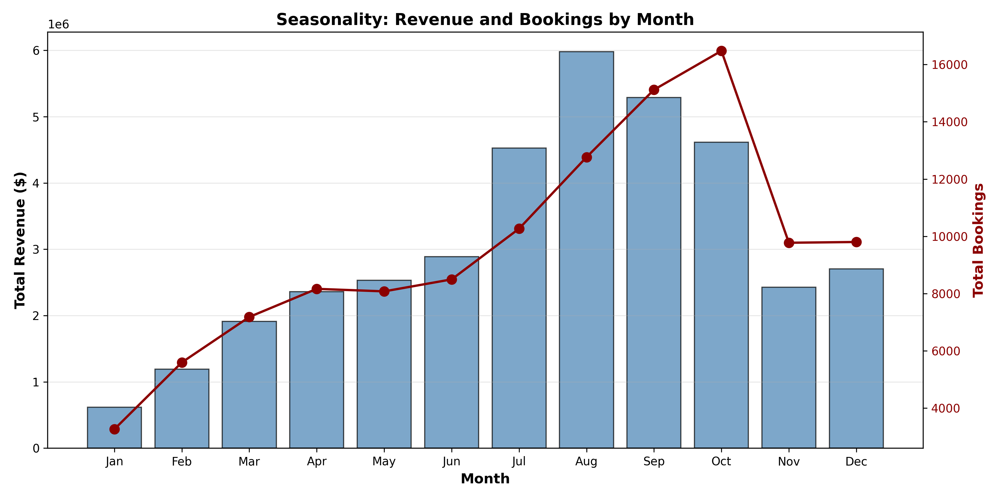

# Hotel Booking Analysis

## 1. Cancellation Rates

Calculate cancellation rates for each month.

---

## 2. Averages

Compute average price and average number of nights for each month.

---

## 3. Monthly Bookings by Market Segment

Count monthly bookings by market segment.

**Note:** In categories, TA means Travel Agents and TO means Tour Operators.

---

## 4. Seasonality

Identify the most popular month of the year for bookings based on revenue.

**Most Popular Month:** August with $5,979,457.45 in revenue

---

*Report generated: 2025-11-04 22:21:33*
