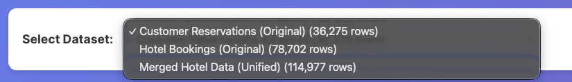
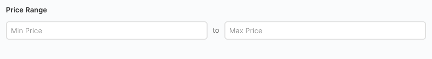
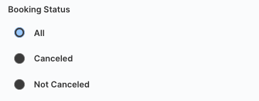
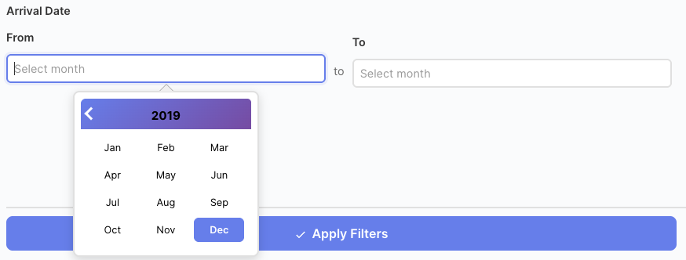
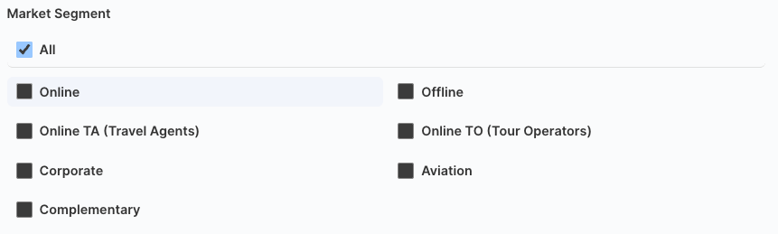
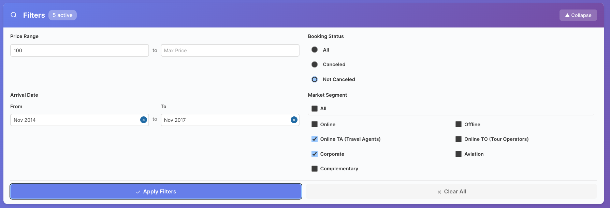
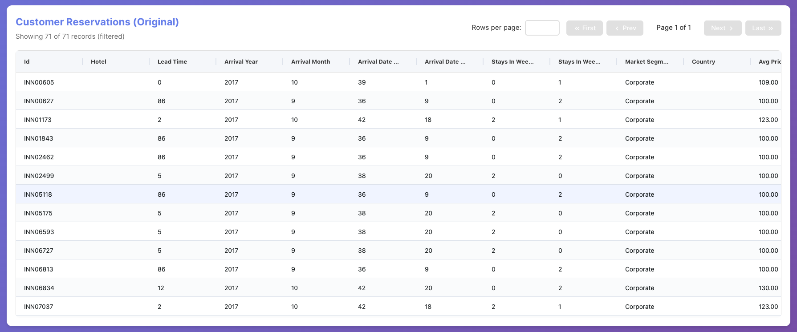
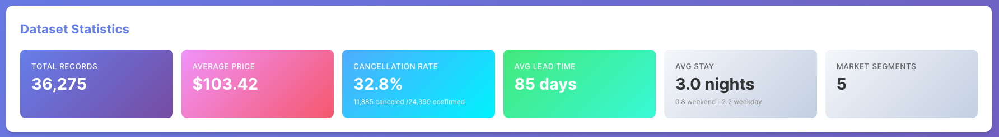

# Phase 3 Report: Interactive Web Application for Hotel Reservations Data

**CS236 Project**  
**Authors:** Pankaj Sharma (SID: 862549035) Saransh Gupta (SID: 862548920)  
**Date:** 25 November 2025

---

## Table of Contents

1. [Introduction](#introduction)
2. [System Overview](#system-overview)
3. [Feature Demonstrations](#feature-demonstrations)
4. [Code Implementation](#code-implementation)
5. [Database Integration](#database-integration)
6. [Conclusion](#conclusion)

---

## Introduction

In this report we discussed the development of the phase 3 of the project, where we built an interactive web application. In this application we provided ability to explore and filter hotel reservation datasets stored in PostgreSQL. The report further discusses the architecture, our methodology for the project.

### Objectives

- Develop a RESTful API backend using FastAPI
- Create an interactive React frontend with filtering capabilities
- Implement seamless data flow from PostgreSQL to the web interface
- Provide real-time statistics and data visualization

---

## System Overview

### Architecture

The application follows a three-tier architecture:

```
Frontend (React) → Backend (FastAPI) → Database (PostgreSQL on AWS RDS)
```

**Database Infrastructure:**

- **Primary:** PostgreSQL database hosted on AWS RDS
- **Alternative:** Docker PostgreSQL container (available for local development)
- **Rationale:** AWS RDS provides easier maintenance, automated backups, and seamless collaboration among team members, making it the preferred choice for the project

**Technology Stack:**

- **Backend:** FastAPI, SQLAlchemy
- **Frontend:** React, TypeScript
- **Database:** PostgreSQL on AWS RDS (with Docker alternative available)

### Data Flow

1. User interacts with UI filters
2. Frontend sends HTTP request to backend API
3. Backend constructs SQL query with filters
4. PostgreSQL executes query and returns results
5. Backend formats data as JSON response
6. Frontend displays results in data grid

---

## Feature Demonstrations

### Feature 1: Dataset Selection



**User Experience:**
Users can select from three available datasets using a dropdown menu. The selection automatically loads the dataset and displays its statistics.

---

### Feature 2: Price Range Filtering



**User Experience:**
Users can enter minimum and maximum price values to filter reservations within a specific price range. The filter only accepts numeric input.

---

### Feature 3: Booking Status Filter



**User Experience:**
Users can filter by booking status using mutually exclusive radio buttons: All, Canceled, or Not Canceled. Only one option can be selected at a time.

---

### Feature 4: Arrival Date Range Filter

>

**User Experience:**
Users can select a date range using month/year pickers for "From" and "To" dates. The calendar interface prevents invalid date selections.

---

### Feature 5: Market Segment Filter



**User Experience:**
Users can select multiple market segments using checkboxes. Selecting "All" or deselecting all options shows all segments. The layout uses a 2-column grid for better space utilization.

---

### Feature 6: Combined Filtering and Clear Filters

>

**User Experience:**
Users can combine multiple filters to narrow down results. The filter panel shows the count of active filters, and all filters work together using AND logic. Users can quickly reset all filters using the "Clear Filters" button, which returns to the unfiltered dataset view.

---

### Feature 7: Data Grid with Pagination



**User Experience:**
Users can view paginated data with configurable page sizes (50-1000 records per page). Columns are sortable by clicking headers, and users can navigate between pages.

---

### Feature 8: Statistics Panel



**User Experience:**
The statistics panel displays real-time metrics for the selected dataset, including price statistics, cancellation rates, and booking patterns.

---

## Code Implementation

### Frontend: Filter Panel Component

**Location:** `frontend/src/components/FilterPanel.tsx`

**Price Range Filter:**

```typescript
const handleNumberInput = (
  e: React.ChangeEvent<HTMLInputElement>,
  field: keyof Filters
) => {
  const numericValue = e.target.value.replace(/[^0-9.]/g, "");
  handleInputChange(field, numericValue);
};

const handleApplyFilters = () => {
  const cleanFilters: Filters = {}
  const allMarketSegments = ['Online', 'Offline', 'Online TA', 'Online TO', 'Corporate', 'Aviation', 'Complementary']
  
  Object.keys(localFilters).forEach(key => {
    const typedKey = key as keyof Filters
    const value = localFilters[typedKey]
    
    if (typedKey === 'market_segment' && Array.isArray(value)) {
      const selectedCount = value.length
      if (selectedCount === 0 || selectedCount === allMarketSegments.length) {
        return
      }
      cleanFilters[typedKey] = value as any
      return
    }
    
    if (value !== '' && value !== null && value !== undefined) {
      if (Array.isArray(value) && value.length > 0) {
        cleanFilters[typedKey] = value as any
      } else if (!Array.isArray(value)) {
        cleanFilters[typedKey] = value as any
      }
    }
  })
  onFilterChange(cleanFilters)
}
```

**Connection to Database:**

- Filter values are sent to backend via API call
- Backend converts to SQL WHERE clauses
- PostgreSQL executes: `WHERE avg_price_per_room >= 100 AND avg_price_per_room <= 200`

---

**Booking Status Filter:**

```typescript
<input
  type="radio"
  name="booking_status"
  checked={localFilters.booking_status?.includes("Canceled")}
  onChange={() => handleInputChange("booking_status", ["Canceled"])}
/>
```

**Connection to Database:**

- Frontend sends: `booking_status=['Canceled']`
- Backend converts to boolean: `is_canceled = TRUE`
- PostgreSQL executes: `WHERE is_canceled = TRUE`

---

**Date Range Filter:**

```typescript
<DatePicker
  selected={
    localFilters.arrival_date_from
      ? new Date(localFilters.arrival_date_from + "-01")
      : null
  }
  onChange={(date: Date | null) => {
    if (date) {
      const year = date.getFullYear();
      const month = String(date.getMonth() + 1).padStart(2, "0");
      handleInputChange("arrival_date_from", `${year}-${month}`);
    }
  }}
  showMonthYearPicker
/>
```

**Connection to Database:**

- Frontend sends: `arrival_date_from='2017-01'`
- Backend parses: `from_year=2017, from_month=1`
- PostgreSQL executes: `WHERE (arrival_year > 2017 OR (arrival_year = 2017 AND arrival_month >= 1))`

---

**Market Segment Filter:**

```typescript
const handleCheckboxChange = (field: keyof Filters, value: string) => {
  setLocalFilters(prev => {
    const currentValues = (prev[field] as string[]) || []
    
    if (field === 'market_segment' && value === 'All') {
      const allMarketSegments = ['Online', 'Offline', 'Online TA', 'Online TO', 'Corporate', 'Aviation', 'Complementary']
      const allSelected = currentValues.length === allMarketSegments.length
      return {
        ...prev,
        [field]: allSelected ? [] : allMarketSegments
      }
    }
    
    const newValues = currentValues.includes(value)
      ? currentValues.filter(v => v !== value)
      : [...currentValues, value]
    
    return {
      ...prev,
      [field]: newValues
    }
  })
}

if (typedKey === 'market_segment' && Array.isArray(value)) {
  const selectedCount = value.length
  if (selectedCount === 0 || selectedCount === allMarketSegments.length) {
    return
  }
  cleanFilters[typedKey] = value as any
  return
}
```

**Connection to Database:**

- Frontend sends: `market_segment=['Online', 'Corporate']`
- Backend uses PostgreSQL ANY operator
- PostgreSQL executes: `WHERE market_segment_type = ANY(ARRAY['Online', 'Corporate'])`

---

**Clear Filters:**

```typescript
const handleClearFilters = () => {
  setLocalFilters({
    min_price: "",
    max_price: "",
    booking_status: [],
    arrival_date_from: "",
    arrival_date_to: "",
    market_segment: [],
  });
  onFilterChange({});
};
```

**Connection to Database:**

- Frontend sends empty filters object: `{}`
- Backend receives no filter parameters
- PostgreSQL executes: `SELECT * FROM table` (no WHERE clause)
- All records are returned unfiltered

---

### Frontend: Data Grid Component

**Location:** `frontend/src/components/DataGrid.tsx`

**Data Loading:**

```typescript
const loadData = async () => {
  const params = {
    page: currentPage,
    page_size: pageSize,
    ...buildFilterParams(filters),
  };

  const response = await getData(dataset.name, params);
  setRowData(response.data);
  setTotalRecords(response.total_records);
};

useEffect(() => {
  loadData();
}, [dataset, filters, currentPage, pageSize]);
```

**Connection to Database:**

- Frontend sends pagination + filter params to API
- Backend constructs SQL with LIMIT/OFFSET
- PostgreSQL executes: `SELECT * FROM table WHERE ... LIMIT 100 OFFSET 0`

---

### Backend: API Endpoint

**Location:** `backend/main.py`

**Filter Query Builder:**

```python
def build_filter_query(base_query: str, filters: FilterParams) -> tuple:
    where_clauses = []
    params = {}

    if filters.min_price is not None:
        where_clauses.append("avg_price_per_room >= :min_price")
        params["min_price"] = filters.min_price

    if filters.booking_status:
        bool_values = []
        for status in filters.booking_status:
            if status in ('Canceled', 'true', 'True', '1'):
                bool_values.append(True)
            elif status in ('Not_Canceled', 'false', 'False', '0'):
                bool_values.append(False)
        
        if bool_values:
            unique_bool_values = list(dict.fromkeys(bool_values))
            if len(unique_bool_values) == 1:
                bool_literal = 'TRUE' if unique_bool_values[0] else 'FALSE'
                where_clauses.append(f"is_canceled = {bool_literal}")
            else:
                or_conditions = [f"is_canceled = {'TRUE' if v else 'FALSE'}" for v in unique_bool_values]
                where_clauses.append(f"({' OR '.join(or_conditions)})")

    if filters.arrival_date_from or filters.arrival_date_to:
        date_conditions = []
        if filters.arrival_date_from:
            from_year, from_month = map(int, filters.arrival_date_from.split('-'))
            date_conditions.append(f"((arrival_year > :from_year) OR (arrival_year = :from_year AND arrival_month >= :from_month))")
            params["from_year"] = from_year
            params["from_month"] = from_month
        if filters.arrival_date_to:
            to_year, to_month = map(int, filters.arrival_date_to.split('-'))
            date_conditions.append(f"((arrival_year < :to_year) OR (arrival_year = :to_year AND arrival_month <= :to_month))")
            params["to_year"] = to_year
            params["to_month"] = to_month
        if date_conditions:
            where_clauses.append(f"({' AND '.join(date_conditions)})")

    if filters.market_segment:
        where_clauses.append("market_segment_type = ANY(:market_segment)")
        params["market_segment"] = filters.market_segment

    if where_clauses:
        query = f"{base_query} WHERE {' AND '.join(where_clauses)}"
    else:
        query = base_query

    return query, params
```

**Data Endpoint:**

```python
@app.get("/api/data/{dataset}", response_model=DataResponse)
async def get_data(
    dataset: str,
    page: int = Query(1, ge=1),
    page_size: int = Query(100, ge=1, le=10000),
    sort_by: Optional[str] = Query(None),
    sort_order: str = Query("asc", pattern="^(asc|desc)$"),
    min_price: Optional[float] = Query(None),
    max_price: Optional[float] = Query(None),
    booking_status: Optional[List[str]] = Query(None),
    db: Session = Depends(get_db)
):
    validate_dataset(dataset)
    
    filters = FilterParams(
        min_price=min_price,
        max_price=max_price,
        booking_status=booking_status,
    )
    
    base_query = f"SELECT * FROM {DB_SCHEMA}.{dataset}"
    query, params = build_filter_query(base_query, filters)
    
    count_query = query.replace("SELECT *", "SELECT COUNT(*)")
    total_records = db.execute(text(count_query), params).scalar()
    
    if sort_by:
        query += f" ORDER BY {sort_by} {sort_order.upper()}"
    else:
        query += " ORDER BY id"
    
    offset = (page - 1) * page_size
    query += f" LIMIT :limit OFFSET :offset"
    params["limit"] = page_size
    params["offset"] = offset

    result = db.execute(text(query), params)
    columns = result.keys()
    data = [dict(zip(columns, row)) for row in result]
    
    total_pages = (total_records + page_size - 1) // page_size

    return DataResponse(
        dataset=dataset,
        total_records=total_records,
        page=page,
        page_size=page_size,
        total_pages=total_pages,
        data=data,
        filters_applied=filters.dict(exclude_none=True)
    )
```

**Connection to Database:**

- Uses SQLAlchemy to execute parameterized SQL queries
- Parameters prevent SQL injection attacks
- Results converted to dictionaries and returned as JSON

---

### Backend: Database Connection

**Location:** `backend/database.py`

**Database Setup:**
The application uses PostgreSQL hosted on AWS RDS for production and development. While a Docker copy of the database is available for local testing, the RDS instance is preferred for easier maintenance, collaboration, and consistent data access across team members.

```python
from sqlalchemy import create_engine
from sqlalchemy.orm import sessionmaker

DATABASE_URL = f"postgresql://{DB_USER}:{DB_PASSWORD}@{DB_HOST}:{DB_PORT}/{DB_NAME}"

engine = create_engine(
    DATABASE_URL,
    pool_pre_ping=True,
    pool_size=10,
    connect_args={"options": f"-csearch_path={DB_SCHEMA}"}
)

SessionLocal = sessionmaker(bind=engine)

def get_db():
    db = SessionLocal()
    try:
        yield db
    finally:
        db.close()
```

**Connection Flow:**

1. SQLAlchemy engine connects to PostgreSQL (AWS RDS)
2. Connection pool manages multiple connections
3. Each API request gets a database session
4. Session executes queries and returns results
5. Session automatically closes after request

**Database Configuration:**

- **Production:** AWS RDS PostgreSQL instance
- **Alternative:** Docker PostgreSQL container (for local development)
- **Benefits of RDS:** Automated backups, easy scaling, team collaboration, managed maintenance

---

## Database Integration

### Query Execution Flow

**Example: Filtering by Price Range**

1. **User Input:** Enters min_price=100, max_price=200
2. **Frontend:** Sends `GET /api/data/merged_hotel_data?min_price=100&max_price=200`
3. **Backend:** Receives parameters and builds SQL:
   ```python
   query = "SELECT * FROM public.merged_hotel_data WHERE avg_price_per_room >= :min_price AND avg_price_per_room <= :max_price"
   params = {"min_price": 100, "max_price": 200}
   ```
4. **PostgreSQL:** Executes parameterized query:
   ```sql
   SELECT * FROM public.merged_hotel_data
   WHERE avg_price_per_room >= 100
     AND avg_price_per_room <= 200
   ```
5. **Backend:** Converts results to JSON
6. **Frontend:** Displays results in data grid

### Security Features

- **Parameterized Queries:** All user inputs are passed as parameters, preventing SQL injection
- **Input Validation:** Pydantic models validate all filter parameters
- **Type Safety:** TypeScript on frontend and Python type hints ensure data integrity

---

## Conclusion

This Phase 3 implementation successfully creates an interactive web application for exploring hotel reservation datasets. The application provides:

- **Intuitive Filtering:** Multiple filter options with real-time updates
- **Efficient Data Access:** Pagination and optimized database queries
- **User-Friendly Interface:** Modern UI with clear visual feedback
- **Secure Implementation:** Parameterized queries prevent SQL injection
- **Real-Time Statistics:** Dynamic metrics that update with filters

The application demonstrates seamless integration between React frontend, FastAPI backend, and PostgreSQL database, providing users with powerful tools for data exploration and analysis.
